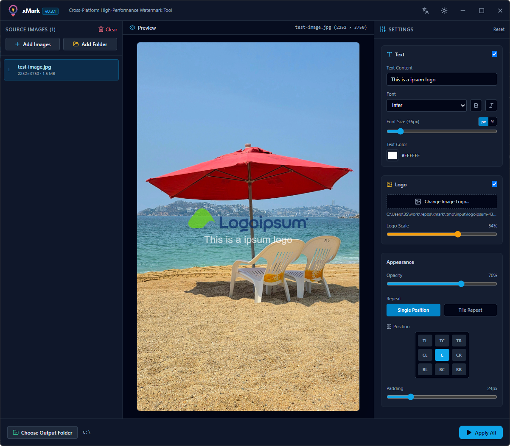

# xMark — Cross-Platform Image Watermark Tool

[](https://github.com/bs135/xmark/actions/workflows/release.yml)
[](LICENSE)

**xMark** is a fast, cross-platform desktop application for batch watermarking images with a logo, text, or both. It combines a Rust backend (via [Tauri](https://tauri.app)) for high-performance image processing with a React + Tailwind CSS frontend for an intuitive user experience.

Supported platforms: **Windows**, **macOS** (Apple Silicon), and **Linux**.



---

## Table of Contents

- [Features](#features)
- [Tech Stack](#tech-stack)
- [Download](#download)
- [Prerequisites](#prerequisites)
  - [Windows](#windows)
  - [macOS](#macos)
  - [Linux (Ubuntu/Debian)](#linux-ubuntudebian)
- [Development](#development)
- [Building for Production](#building-for-production)
- [Usage Guide](#usage-guide)
- [Contributing](#contributing)
- [Acknowledgements](#acknowledgements)
- [License](#license)

---

## Features

- Batch watermarking of `.png`, `.jpg`, `.jpeg`, `.webp`, and `.bmp` images.
- Text watermarks with configurable font family, size (pixel or percentage-based), color, bold, and italic styles.
- Logo/image watermarks with adjustable scale.
- Adjustable opacity, padding, and placement (single position on a 9-point grid, or repeating tile pattern).
- Live, real-time canvas preview before exporting.
- High-throughput, multi-threaded batch export powered by Rust and [Rayon](https://github.com/rayon-rs/rayon).
- Persisted settings (output folder, watermark configuration, theme, language) across sessions.
- Dark/light theme and English/Vietnamese localization.

## Tech Stack

- **Desktop Framework**: [Tauri v2](https://tauri.app)
- **Backend (Rust)**:
  - **Image Processing**: [`image`](https://crates.io/crates/image), [`imageproc`](https://crates.io/crates/imageproc)
  - **Typography & Font Rendering**: [`ab_glyph`](https://crates.io/crates/ab_glyph)
  - **Parallelism**: [`rayon`](https://crates.io/crates/rayon) for multi-threaded batch exports
- **Frontend (Web)**:
  - **Framework & Language**: [React 19](https://react.dev) + [TypeScript](https://www.typescriptlang.org)
  - **Build Tool**: [Vite](https://vitejs.dev)
  - **Styling**: [Tailwind CSS](https://tailwindcss.com)
  - **State Management**: [Zustand](https://github.com/pmndrs/zustand)
  - **Localization**: [i18next](https://www.i18next.com) & [react-i18next](https://react.i18next.com)
  - **Virtualization**: [react-window](https://github.com/bvaughn/react-window)
  - **Icons**: [Lucide React](https://lucide.dev)
- **Packaging & CI/CD**:
  - Windows (NSIS `.exe`, WiX `.msi`), macOS (`.dmg`), Linux (`.deb`, `.rpm`, `.AppImage`)
  - Automated multi-platform releases via GitHub Actions

## Download

Prebuilt installers for every release are published on the [GitHub Releases](https://github.com/bs135/xmark/releases) page:

- **Windows**: `xMark_<version>_windows_x64-setup.exe` (NSIS) or `xMark_<version>_windows_x64.msi` (WiX).
- **macOS**: `xMark_<version>_darwin_aarch64.dmg` (Apple Silicon M1/M2/M3).
- **Linux**: `xMark_<version>_linux_amd64.deb`, `xMark_<version>_linux_amd64.AppImage`, or `xMark_<version>_linux_x86_64.rpm`.

Release assets are formatted with platform and architecture identifiers (`[name]_[version]_[platform]_[arch][setup][ext]`).

To try an in-progress branch build, trigger the **Release** workflow via `workflow_dispatch` from the [Actions](https://github.com/bs135/xmark/actions) tab and download the resulting artifacts.

---

## Prerequisites

xMark is built with [Tauri v2](https://tauri.app), which requires Node.js, Rust, and a platform-specific WebView toolchain.

### Windows

| Requirement | How to install |
|---|---|
| Node.js 18+ | `winget install OpenJS.NodeJS.LTS` or download from [nodejs.org](https://nodejs.org/) |
| Rust & Cargo 1.77+ | `winget install Rustlang.Rustup` or via [rustup.rs](https://rustup.rs/) |
| Microsoft C++ Build Tools | Install [Visual Studio Build Tools](https://visualstudio.microsoft.com/visual-cpp-build-tools/) with the **Desktop development with C++** workload |
| WebView2 Runtime | Preinstalled on Windows 10/11; if missing, download from [Microsoft's WebView2 page](https://developer.microsoft.com/microsoft-edge/webview2/) |

### macOS

| Requirement | How to install |
|---|---|
| Xcode Command Line Tools | `xcode-select --install` |
| Rust & Cargo 1.77+ | `brew install rustup-init && rustup-init` or via [rustup.rs](https://rustup.rs/) |
| Node.js 18+ | `brew install node` |

### Linux (Ubuntu/Debian)

| Requirement | How to install |
|---|---|
| System libraries for Tauri | `sudo apt update && sudo apt install libwebkit2gtk-4.1-dev build-essential curl wget file libxdo-dev libssl-dev libayatana-appindicator3-dev librsvg2-dev` |
| Rust & Cargo 1.77+ | `curl --proto '=https' --tlsv1.2 -sSf https://sh.rustup.rs \| sh` (see [rustup.rs](https://rustup.rs/)) |
| Node.js 18+ | `sudo apt install nodejs npm`, or use [nvm](https://github.com/nvm-sh/nvm) for a specific version |

> For other distributions (Fedora, Arch, etc.), see the official [Tauri Linux prerequisites](https://v2.tauri.app/start/prerequisites/#linux) for the equivalent system packages.

---

## Development

Install dependencies and start the app in development mode with hot-reloading:

```bash
npm install
npm run tauri dev
```

This will:
1. Start the Vite dev server on port `5173` (with Hot Module Replacement).
2. Compile the Rust backend.
3. Launch the xMark desktop window.

## Building for Production

To produce a native installer for your platform:

```bash
npm run tauri build
```

The resulting bundle will be located under:

```text
src-tauri/target/release/bundle/
```

(e.g. `msi/` or `nsis/` on Windows, `dmg/` on macOS, `deb/`, `rpm/`, or `appimage/` on Linux)

---

## Usage Guide

1. **Add source images (left panel)**
   - Click **Add Images** to select one or more individual image files.
   - Click **Add Folder** to select a directory; xMark automatically scans for `.png`, `.jpg`, `.jpeg`, `.webp`, and `.bmp` files.
   - Click an image in the list to preview it, or the trash icon to remove it from the list.

2. **Configure the watermark (right panel)**
   - **Text**: enable the checkbox, enter text content, adjust font size and color.
   - **Logo**: enable the checkbox, choose a logo file, and drag the slider to adjust scale.
   - **Opacity**: adjust from 5% to 100% (default 50%).
   - **Repeat**:
     - *Single Position*: stamp the watermark at one fixed position on a 9-point grid (top-left, center, bottom-right, etc.).
     - *Tile Repeat*: repeat the watermark evenly across the entire image as an anti-copy grid pattern.
   - **Padding**: fine-tune the distance from the edges.

3. **Preview (center panel)**
   - See a real-time watermark preview on canvas before exporting.

4. **Batch export (footer bar)**
   - Click **Choose Output Folder** to select where processed images will be saved.
   - Click **Apply All** to start high-speed, multi-threaded processing powered by Rayon in Rust.
   - Track progress and completion status in the status bar.

---

## Contributing

Issues and pull requests are welcome. Please follow [Conventional Commits](https://www.conventionalcommits.org/) for commit messages, as releases are automated based on them.

## Acknowledgements

This project was developed with the assistance of AI.

## License

xMark is released under the [MIT License](LICENSE).
